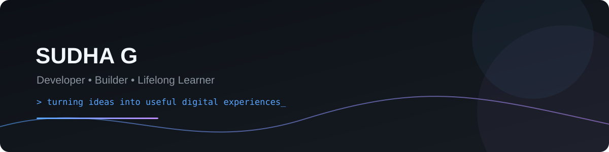

# Hi, I'm Sudha G 👋

  

  
  

## 👩‍💻 About Me

I'm **Sudha G**, a developer interested in creating practical, responsive, and user-focused digital experiences across modern web and business platforms.

- 🌐 Web development & responsive UI
- ⚛️ React application development
- 🧩 WordPress & Wix website customization
- 🏢 SharePoint / Microsoft 365 solutions
- 🎨 Bootstrap-based responsive interfaces
- 📚 Continuous learning and hands-on projects

## 🛠️ Tech & Platforms

  

**Platforms:** WordPress • SharePoint • Wix  
**Development:** React • JavaScript • HTML • CSS • Bootstrap  
**Tools:** Git • GitHub • VS Code

## 🚀 Portfolio Projects

### 🌐 WordPress Business Website
A professional business-site concept focused on responsive design, content structure, services, testimonials, and SEO-friendly layouts.

**Stack:** WordPress • PHP • HTML • CSS • JavaScript  
📁 [View project](./projects/wordpress-business-site)

### ⚛️ React Task Dashboard
A modern task-management dashboard demonstrating reusable components, filtering, state management patterns, and responsive UI.

**Stack:** React • JavaScript • Vite • CSS  
📁 [View project](./projects/react-task-dashboard)

### 🎨 Bootstrap Product Landing Page
A mobile-first product landing page using Bootstrap's responsive grid and reusable components.

**Stack:** HTML • Bootstrap 5 • JavaScript  
📁 [View project](./projects/bootstrap-product-landing)

### 🏢 SharePoint Team Hub
A SharePoint intranet concept for announcements, quick links, documents, projects, and team resources.

**Stack:** SharePoint Online • Microsoft 365 • SPFx • TypeScript  
📁 [View project](./projects/sharepoint-team-hub)

### ✨ Wix Service Website
A Wix/Velo service-business concept combining CMS-ready content with JavaScript customization and lead capture.

**Stack:** Wix • Wix CMS • Velo • JavaScript  
📁 [View project](./projects/wix-service-website)

## 💡 What I Like Building

- 🌐 Business & portfolio websites
- ⚛️ Interactive React applications
- 🏢 Intranet and collaboration solutions
- 📱 Responsive user interfaces
- 🔧 CMS customizations
- 🤖 Practical productivity solutions

## 📈 GitHub Activity

  
  

  

## 📫 Connect With Me

  

---

<b>✨ Build. Learn. Improve. Repeat.</b>

